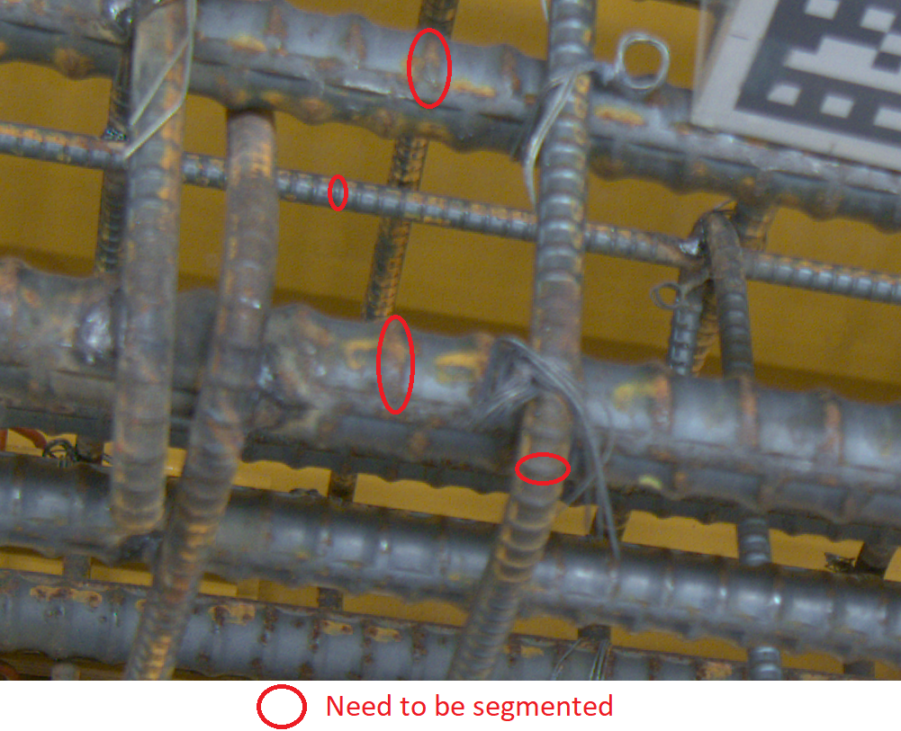

# Knot-Segmentation

This repo is created to describe the project `Knot Segmentation` conducted from Jul. 2020 to Aug. 2020 between [CyberCore AI](https://cybercore.co.jp/) and [TODA Construction](https://www.toda.co.jp/english/)  
The code is belongs into CyberCore AI. 
## Requirements  
1. Segment the knot (image bellow)  

   

2. Small model with acceptable accuracy and run at least 10 fps on CPU i5-9400.

## Role
Team member of a team with 2 people. I manily focus on implementing various loss functions and adjust the dataset’s labels.
## Results
The model is delivered to the customer.
### Model benchmark
Test on PC: 6-core Intel(R) Core(TM) i5-9400 CPU @ 2.90GHz, 16 GiB RAM

|               Model              | Input size | Output size |  mIoU  |  FPS |
|:--------------------------------:|:----------:|:-----------:|:------:|:----:|
| Modle1 |  768x1280  |   384x640   | 0.4366 | 4.28 |
| Model2 |  768x1280  |   192x320   | 0.4231 | 6.88 |

Note: Decrease the size of the input image will help to achieve the required speed.
### Visualization

  
   

